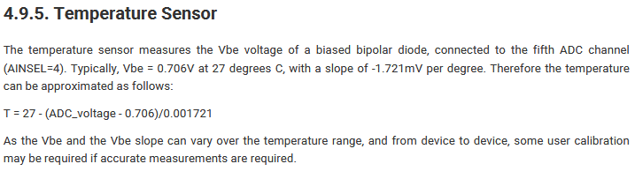

## Proposta

Faça um programa em C para ler a temperatura interna do RP2040. Converta a leitura do ADC em um valor em ºC. 

## Fórmula usada

-
[Fonte](https://datasheets.raspberrypi.com/rp2040/rp2040-datasheet.pdf)

## Bibliotecas usadas
- [Biblioteca 1306](https://github.com/daschr/pico-ssd1306)
