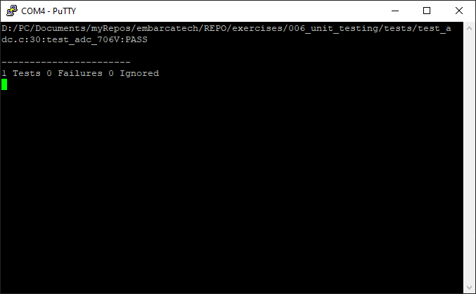
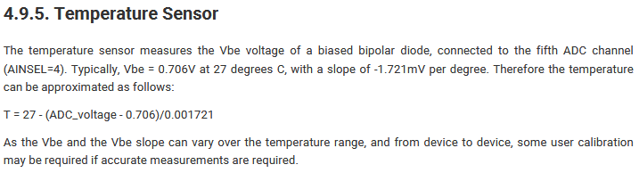

## Proposta

### Tarefa:
```
- Implemente a função float adc_to_celsius(uint16_t adc_val);
- Escreva uma função de teste unitário que verifica se a função retorna o valor correto (com margem de erro) para uma leitura simulada de ADC. Sugere-se o uso da biblioteca Unity para o teste unitário.
- Use um teste com valor de ADC conhecido (ex.: para 0.706 V, a temperatura deve ser 27 °C).
```

### Resultado do Teste:



### Fórmula Usada:


-
[Fonte](https://datasheets.raspberrypi.com/rp2040/rp2040-datasheet.pdf)

### Biblioteca Usada:

[Unity](https://github.com/ThrowTheSwitch/Unity)
