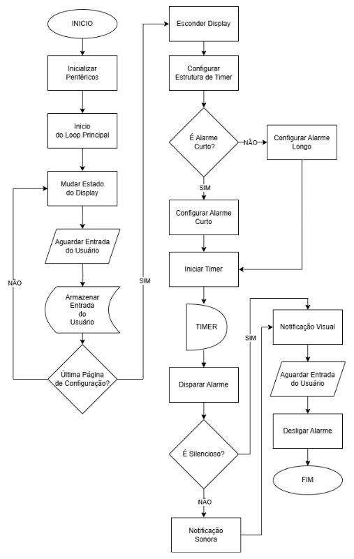
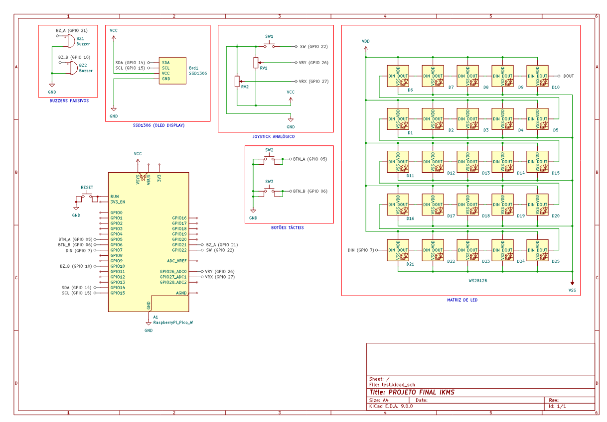

# 📌 Projeto: Sistema de Alarme para Tarefas Diárias
Um sistema embarcado de alarmes para tarefas cotidianas desenvolvido na placa BitDogLab, permitindo configuração de alarmes de curta e longa duração através de uma interface gráfica simples.

## 🎯 Objetivo do Projeto
O projeto visa desenvolver um sistema embarcado de alarmes que:
 - Permite configurar alarmes de curta duração (até 24h) ou longa duração (até 14 dias)
 - Oferece uma interface intuitiva usando botões e joystick
 - Disponibiliza um modo silencioso onde o alarme é indicado apenas visualmente
 - Funciona de forma independente da internet
 - Proporciona uma alternativa econômica e focada para marcação de tempo

---

## 🧩 Componentes Usados
- Raspberry Pi Pico
- LED RGB WS2812B
- Buzzer
- OLED I2C SSD1306
- Joystick
- Push Button

---

## ⚡ Pinagem dos Dispositivos
| Componente | Pino do Pico |
|------------|--------------|
| **Push Button A** | 5 |
| **Push Button A** | 6 |
| **Buzzer A** | 21 |
| **Buzzer B** | 10 |
| **OLED SSD1306 (SDA)** | 14 |
| **OLED SSD1306 (SCL)** | 15 |
| **Joystick Y** | 26 |
| **Joystick X** | 27 |
| **Joystick SW** | 22 |
| **LED WS2812B** | 7 |

---

## 🧪 Como Compilar e Executar
### Pré-Requisitos:
- BitDogLab
- Pico SDK
- CMake

### Passos:
1. Abra o projeto no VS Code, usando o ambiente com suporte ao SDK do Raspberry Pi Pico (CMake + compilador ARM);
2. Compile o projeto normalmente (Ctrl+Shift+B no VS Code ou via terminal com cmake e make);
3. Conecte sua BitDogLab via cabo USB e coloque a Pico no modo de boot (pressione o botão BOOTSEL e conecte o cabo);
4. Copie o arquivo .uf2 gerado para a unidade de armazenamento que aparece (RPI-RP2);

---

## 🖼️ Imagens e Vídeos

### Fluxograma

### Diagrama do Circuito

---

## 📈 Resultados Esperados ou Observados
- Configuração de alarmes de curta duração (até 24 horas)
- Configuração de alarmes de longa duração (até 14 dias)
- Interface gráfica simples e intuitiva via display OLED
- Modo silencioso com notificação visual através da matriz de LEDs
- Operação totalmente independente da internet
- Acionamento preciso de alarmes com alertas visuais e sonoros
- Desativação do alarme via botões A, B ou SW do joystick
- Suporte para carregamento por mini painel solar

- Tempo de resposta da interface: < 100ms
- Acionamento de alarme: < 200ms após o tempo programado
- Alerta sonoro na frequência de 520Hz

---

## 📄 Licença
Este projeto está licenciado sob a [GNU General Public License v3.0](/LICENSE)

---

### 🔗 Referências
- [Documentação do Raspberry Pi Pico](https://www.raspberrypi.com/documentation/pico-sdk/)
- [Datasheet do WS2812B](https://cdn-shop.adafruit.com/datasheets/WS2812B.pdf)
- [Biblioteca 1306](https://github.com/daschr/pico-ssd1306)

